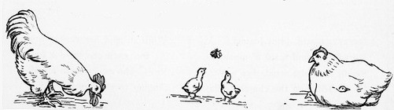

**Figure 7**

*Chicken Family*

*Note*. From [[I7](/citations?id=citation-i7)]. CC0.

# Citations

## Content

##### [C1] Animal and Plant Health Inspection Service. (2026, February 5). Defend the flock. United States Department of Agriculture. https://www.aphis.usda.gov/livestock-poultry-disease/avian/defend-the-flock :id=citation-c1

##### [C2] Lamb, S. (2026). Preventative Medicine in Backyard Poultry [Class handout]. University of Arizona College of Veterinary Medicine, SEL 032. :id=citation-c2

##### [C3] Marcano, V.C. (2026). I Have a Few Chickens in my Backyard [Class handout]. University of Arizona College of Veterinary Medicine, SEL 032. :id=citation-c3

##### [C4]  Marino, A., & Hess, L. (2017). How Not to “Wing It” with Backyard Poultry. Journal of Avian Medicine and Surgery, 31(4), 382–386. https://doi.org/10.1647/1082-6742-31.4.382 :id=citation-c4

##### [C5] Morishita, T. Y., & Greenacre, C. B. (Eds.). (2021). Backyard Poultry Medicine and Surgery : A Guide for Veterinary Practitioners (Second edition). Wiley-Blackwell. :id=citation-c5

##### [C6] U.S. Poultry and Egg Association. (n.d.). *Animal Health*. National Poultry Improvement Project. https://www.poultryimprovement.org/index.cfm :id=citation-c6

## Images

##### [I1] Brooks, L.L. (1903). Chicken Chase [Drawing]. Reusable Art. https://www.reusableart.com/chickens-52.html :id=citation-i1

##### [I2] Harcourt, H. (1889). A Movable Poultry-House in its Simplest Form [Drawing]. Flickr. https://www.flickr.com/photos/britishlibrary/11109201615 :id=citation-i2

##### [I3] Hill, T.E. (1882). Silky Fowl [Drawing]. Reusable Art. https://www.reusableart.com/chickens-35.html :id=citation-i3

##### [I4] Merrill, F.T. (1900). Hatching Chicks [Drawing]. Reusable Art. https://www.reusableart.com/chicks-merrill.html :id=citation-i4

##### [I5] Sowerby, J.G. (1880). Chicken Family [Drawing]. Reusable Art. https://www.reusableart.com/d/4039-2/chickens-25.jpg :id=citation-i5

##### [I6] thecmn. (2018). Chicken on Farm [Drawing]. Flickr. https://www.flickr.com/photos/97947597@N00/45447037524 :id=citation-i6

##### [I7] Woodward, E. (1939). Gossip [Drawing]. Smithsonian. https://www.si.edu/object/gossip:saam_1935.13.394 :id=citation-i7

## Technology
##### [T1] [Docsify](https://github.com/docsifyjs/docsify/ ':target=_blank') (v4.4.4) [A magical documentation site generator]. https://github.com/docsifyjs/docsify/] :id=citation-t1