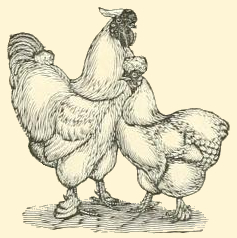

**Figure 6**

*Silky Fowl*

*Note*. From [[I3](/citations?id=citation-i3)]. CC0.

# Contributing

1. [Fork the repository](https://docs.github.com/en/pull-requests/collaborating-with-pull-requests/working-with-forks/fork-a-repo ':target=_blank')
2. [Edit the fork](https://docs.github.com/en/pull-requests/collaborating-with-pull-requests/working-with-forks/fork-a-repo#editing-a-fork ':target=_blank')
3. [Submit a pull request](https://docs.github.com/en/pull-requests/collaborating-with-pull-requests/proposing-changes-to-your-work-with-pull-requests/about-pull-requests ':target=_blank') to the original How to Chicken repository.

For more information on [pull requests](https://github.blog/developer-skills/github/beginners-guide-to-github-creating-a-pull-request/ ':target=_blank'), or other GitHub information see [GitHub's getting started documentation](https://docs.github.com/en/get-started ':target=_blank').

The GitHub respository for this site is located [here](https://github.com/whatthevet/howtochicken ':target=_blank').