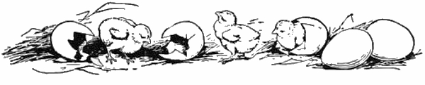

**Figure 2**

*Hatching Chicks*

*Note*. From [[I4](/citations?id=citation-i4)]. CC0.

# How to begin

## Considerations

Similar to the saying, "With great power comes great responsibility"...backyard chicken ownership also comes with many responsibilities. It is important to consider a variety of things before obtaining backyard chickens. Below a few considerations are outlined:

### Legal: Laws/Ordinances/HOA

Different US states have different laws regarding backyard poultry ownership. Likewise, counties, cities, and homeowners associations may have different ordinances and rules that apply to your community. Make sure to check into your State's statutes, county and city ordinances and HOA bylaws.

### Space

Enough space for each chicken is important for their general health and stress level. The exact amount of space needed is up for debate, with generally more space needed for older chickens vs. younger chickens [[C5](/citations?id=citation-c5)]. Some experts recommend 8 - 10 square feet per chicken [[C2](/citations?id=citation-c2)], while others suggest recommendations of 8 square feet for smaller meat birds (less than 5.5 lbs) to 12 square feet for laying hens [[C5](/citations?id=citation-c5)]. More space can always be added later as long as the property allows [[C5](/citations?id=citation-c5)].

## Buying your chicken(s)

Ideally get your chickens from a National Poultry Improvement Plan (NPIP) certified hatchery. These hatcheries are tested/monitored for certain diseases:

> " The NPIP was initiated to help diminish the spread of Pullorum Disease, caused by Salmonella Pullorum which was rampant in the poultry industry and could cause upwards of 80% mortality in baby poultry. The program was later extended to include testing and monitoring for other poultry diseases [[C6](/citations?id=citation-c6)]."

##### [Find NPIP Participants By US State](https://www.poultryimprovement.org/statesContent.cfm ':target=_blank')

NPIP certified chicken flocks are currently monitored and tested for many different diseases including [[C5](/citations?id=citation-c5)]:

* Salmonella Pullorum (Causative agent of Pullorum disease)
* Salmonella Gallinarum (Causative agent of Fowl Typhoid)
* Mycoplasma gallisepticum
* Mycoplasma synoviae
* Avian Influenza

It is also important to obtain a certificate of purchase, which may show any important vaccinations given for common chicken diseases, such as Marek's disease, prior to purchase. While this is important to have, one veterinarian estimated less than 10% of backyard chicken owners that come into their clinic have a certificate of purchase or information regarding prior vaccination [[C3](/citations?id=citation-c3)]:

### Chicken types

Chickens have been bred and owned for various purposes:

* meat chickens
* egg-laying chickens
* dual chickens (eggs and meat)
* ornamental chickens [[C5](/citations?id=citation-c5)]. 

Which type of chicken to own is a personal decision based on why you want to own a chicken, where you live, how big your property is and other factors. For example, a laying hen will be a good type of chicken to own if you or your family want to own chickens to provide eggs. However, certain breeds of laying hens may be more or less suited to live in warmer climates.