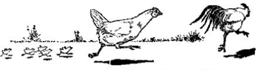

**Figure 5**

*Chicken Chase*

*Note*. From [[I1](/citations?id=citation-i1)]. CC0.

# Resources

## [Arizona Department of Agriculture Backyard Birds](https://agriculture.az.gov/animals/state-veterinarians-office/animal-species-specific-information/poultry/backyard-birds ':target=_blank')

> "Raising poultry at home can be more than a hobby. Birds, like other pets, teach responsibility; they also teach about agriculture and provide food. The trend for backyard birds, especially in cities, is growing. A recent survey found 70% of backyard bird owners have less than 10 birds, and most of the birds are kept for food (eggs and meat), natural pest eaters and pets. It’s also possible to compost the birds’ manure as fertilizer for plants."  

-<cite>Arizona Department of Agriculture</cite>

## [National Poultry Improvement Plan State Participants](https://www.poultryimprovement.org/statesContent.cfm ':target=_blank')

> "Hatcheries, dealers, and independent flocks participating in the National Poultry Improvement Plan (NPIP)"

-<cite>National Poultry Improvement Plan</cite>

## [The University of Arizona Cooperative Extension Poultry](https://extension.arizona.edu/topics/poultry ':target=_blank')

> "Whether you have a few backyard chickens or a small-scale commercial operation, Extension has the information you need to keep your poultry healthy and productive, giving you a steady stream of eggs or profit, whichever you are after. We have information about diseases, feeding, housing, predator protection and more for you or your kids, if they are in 4-H."

-<cite>The University of Arizona</cite>

## [US Department of Agriculture Animal and Plant Health Inspection Service Defend the Flock Program](https://www.aphis.usda.gov/livestock-poultry-disease/avian/defend-the-flock ':target=_blank')

> "Biosecurity is the key to keeping our Nation’s poultry healthy. USDA’s Defend the Flock education program offers free tools and resources to help everyone who works with or handles poultry follow proper biosecurity practices. These practices will help keep your birds healthy and reduce the risk of avian influenza and other infectious diseases. Biosecurity is everyone’s job. Become a Flock Defender today and help us protect all flocks!" 

-<cite>USDA APHIS</cite>